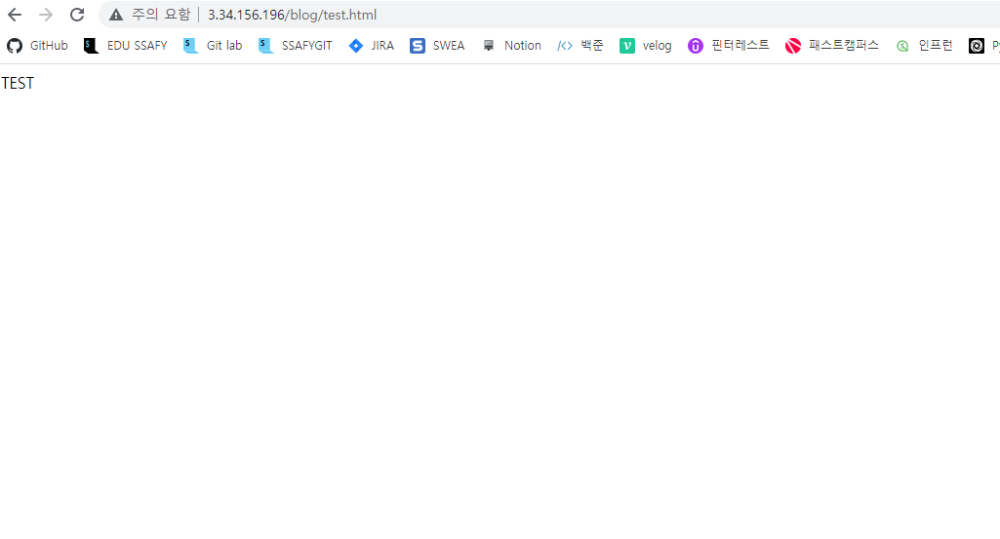
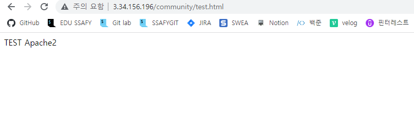

# 웹서버 이해와 구축

## Apache와 nginx 웹서버 이해

### 웹서버

- 웹서버는 HTTP 요청을 읽어서, 응답을 해주는 프로그램
- 웹서버 프로그램을 서버상에 설치하여, 특정 HTTP 요청에 따라, 서비스를 제공해주는 방식으로 웹서비스를 구현
- 상용으로 많이 쓰이는 웹서버 프로그램은 크게 apache 와 nginx가 있으며, 간략히 두 프로그램일 비교하며 웹서버에 대해 이해함


### Apache vs Nginx

- Apache는 오픈소스 프로젝트로 가장 유명한 프로그램 중 하나
- 수십년간 웹서버 프로그램으로는 Apache 프로그램을 사용하였음 

#### Apache 구동 방식

- Apache는 꾸준히 성능을 개선하고 있으며, 다음과 같이 두 가지 기본적인 방식을 지원함
    - Prefork MPM(Multi Processing Module) 방식
        - HTTP 요청이 올 때마다, 프로세스를 복제하여, 각각 별도 프로세스에서 해당 HTTP 요청 처리
    - Worker MPM (Multi Processing Module) 방식
        - 하나의 HTTP 연결 후, 여러 요청을 처리하기 위해, 복제된 프로세스 내에서 여러 쓰레드를 생성하여, 여러 HTTP 요청을 처리하는 방식 

#### Nginx 구동 방식

- Event Driven 방식

    - 하나의 프로세스로 동작하며, HTTP 요청을 event로 비동기식으로 처리함
        - 대부분의 HTTP 응답은 결국 html 파일을 제공하는 것이므로, IO 작업
        - 따라서, IO 작업으로 event를 포워딩하고, 요청 순이 아닌, 요청 작업이 끝난 순으로 처리함
    - HTTP 요청마다, 프로세스든 쓰레드든 생성이 필요없으므로, 시스템 자원 관리에 장점이 있음
    - 보통 많은 접속자가 있을 경우, 시스템 자원 관리 효율성 때문에, Nginx가 보다 일반적으로는 성능이 좋을 수 있음
        - HTML 파일 사이즈, 어떤 추가 기능을 쓰느냐 등등 다양한 조건 때ㅜㅁㄴ에, 무조건 성능이 좋다고 이야기할 수 없음 

    > 단 웹서버는 다양한 추가 기능과 함게 동작하므로, 종합적인 성능에는 큰 차이를 보이지는 않음
    >
    > (예를 들어, PHP 언어 지원을 위해, Apache와 Nginx는 추가 모듈등이 필요하고, 해당 모듈의 성능도 종합 성능에 영향을 미침)


### Nginx 기본 사용법

> docker를 사용하는 큰 이유 중 하나가, 서버용 프로그램이 버전과, 리눅스 패키지마다, 설정 방법이 매우 다르기 때문임 
>
> 따라서, 본 설정은 참고용 (ubuntu 20.04, nginx 1.18.0 버전 테스트)

```bash
docker run -dit -p 80:8080 --name myos ubuntu:20.04
docker exec -it myos /bin/bash 

apt-get update 
apt-cache policy nginx #추천 버전 확인
apt-get install nginx=1.18.0-0ubuntu1.2 #6.Asia 69. Seoul
apt-get install vim
```

- 다음 작업을 진행한 후, localhost:8080 접속 

```bash
vi sites-avaliable/default 

--------------default 파일 수정 
server {
		listen 8080 default_server; #listen 80을 8080으로 변경 
}
---------------
service nginx restart

```

> 이상의 작업을 완료한 후, 다음 설명을 통해, 세부적인 부분들을 이해

#### nginx.conf

```bash
find -name nginx.conf 
vi /etc/nginx/nginx.conf
```

- nginx 웹 서버 기본 설정 파일

- 크게 user, worker_processes, pid, events,http 항목으로 이루어짐

    - user : 웹서버를 돌리는 유저의 ID가 무엇인가
    - worker_proceses : 프로세서를 몇 개 만들 것인가
    - pid : 시스템과 nginx의 연결고리 설정 
    - include : 설정이 하나만 있는 것이 아니라 캡슐화 되어 있을 수 있으므로, 설정이 있는 다른 파일들을 불러오는 명령
    - events : 하나의 프로세스가 events를 받아서 처리하는 방식이므로, event를 몇개까지 받아서 지원할지
    - http : 

- 이 중에서 http 블록이 전체 웹서버 기본 설정 항목임

    - 참고 : http 블록에서 설정할 수 있는 모든 설정

- http 블록 중 다음 항목으로 다양한 웹서비스를 별도 파일로 설정하는 것이 일반적임

    - /etc/nginx/conf.d**/mysite.com.conf** 형태로 웹서비스별 설정을 별도 파일로 할 수 있음 

    - 관련 파일에는 server 항목 설정 (다음 default 파일의 server 설정에서 상세 내용 확인)

##### 참고 

> nginx를 어덯게 설치하느냐에 따라서, 설정 파일등의 위치가 다를 수 있음
>
> 이 때문에 실수하는 경우가 많음
>
> 예를 들어 ubuntu에서 apt-get으로 설치 시와 nginx 도커로 설치 시 설정 파일 위치등이 다를 수 있음

- ubuntu 등 특정 패키지에서 설치한 nginx에서는 `/etc/nginx/sites-enalbed` 폴더도 include 되어 있을 것임
- 해당 폴더는 `/etc/nginx/sites-available` 폴더의 심볼릭 링크 폴더임
- 즉, `/etc/nginx/sites-available` 폴더에 파일을 작성해놓으면, 자동으로 `/etc/nginx/sites-enabled/`폴더에 넣어진 것으로 보이게 되고, 해당 파일들은 nginx.conf의 http 항목의 include 명령을 통해, 웹서버 설정에 적용됨
- 그렇기 때문에, `/etc/nginx/sites-available/default` 파일 변경 후, nginx 재실행시, 반영이 되는 것임
- 디폴트 웹서비스 설정은 ubuntu 20.04/ nginx 1.18.0의 경우, 
    - `/etc/nginx/sites-available/default`라는 파일에 있음
    - `/etc/nginx/conf.d/mysite.com.conf` 형태로 작성하는 경우도 있지만, ubuntu 20.04 / nginx.1.18.0의 경우에는 default 웹서비스 설정을 하고, 추가 웹서비스가 있다면, 별도로 또 다른 mysite.com 등의 파일을 해당 폴더에 작성하면 됨

```
include /etc/nginx/conf.d/*.conf;
include /etc/nginx/sites-enabled/*;
```

- 심볼릭 링크

```
/etc/nginx/sites-enabled# ls -al
total 8
drwxr-xr-x 2 root root 4096 Oct  3 19:38 .
drwxr-xr-x 8 root root 4096 Oct  3 19:38 ..
lrwxrwxrwx 1 root root   34 Oct  3 19:38 default -> /etc/nginx/sites-available/default
```

#### default 파일의 server 설정

- listen은 HTTP 요청을 받을 포트 설정
- **default_server는 모든 웹서버 요청을 받는다는 의미**
- 두 번째 줄의 listen은 IPv6 포트 관련 설정이므로 무시해도 됨

```
listen 80 default_server;
listen [::]:80 default_server;
```

- server_name은 요청을 받을 도메인 이름 설정
    - localhost나 별도 도메인 이름이 없다면, 기본 설정으로 놔두면 됨(`_`)

```
server_name holawan.org www.holawan.org
```

- location 설정
    - location 기본 설정 이해
        - 웹서버 주소에 따라, 요청되는 파일을 찾는 디폴트 폴더를 root로 설정하고, 
        - location 설정으로 웹서버 주소에 따른 폴더를 변경할 수 있음
        - index는 해당 웹서버 주소 요청시, 디폴트로 응답할 index.html 파일명 설정
            - 예를 들어, PHP 언어를 쓴다면, index.php로 디폴트 파일을 설정하기 위해 설정
- location 설정 테스트 : 하위경로를 설정해 다른 서버로 보내기?

```nginx
vi /etc/nginx/sites-available/default

location /blog {

                root/var/www;
        }

        location /flask {

                root /var/www;
        }

        location / {
                # First attempt to serve request as file, then
                # as directory, then fall back to displaying a 404.
                try_files $uri $uri/ =404;
        }
```

## nginx로 Reverse Proxy 도커 구축하기

### Nginx reverse proxy

#### Proxy Server란

- 클라이언트가 자신을 통해 ,다른 네트워크 서비스에 접속하게 해줄 수 있는 서버를 의미함 

#### Forward Proxy 란

- 클라이언트가 외부 인터넷에 직접 접근하는 것이 아니라, 
- 클라이언트가 Proxy Sever에 외부 인터넷 접근 요청을 하고, 
- Proxy Server가 외부 인터넷에 대신 접속하여 결과를 받은 후, 클라이언트에게 전달하는 서버

> 중국은 거대한 Forward Proxy 서버가 있어서, 중국 내 모든 사용자의 접속을 다 받아서, 외부(국외) 인터넷 접속을 제어함
>
> 클라이언트가 자주 접속하는 외부 서비스가 있다면, 관련 데이터를 캐쉬로 저장해놓을 수 있으므로, 성능 향상도 가능함 

#### Reverse Proxy 란

- 클라이언트가 Reverse Proxy에 요청하면, 
- Reverse Proxy가 관련 요청에 따라, 적절한 내부 서버에 접속하여, 결과를 받은 후, 클라이언트에 전달

> 내부 데이터베이스등의 직접 접속등을 허용하지 않을 수 있으므로 보안에도 유익함
>
> 요청 트래픽을 관리할 수 있는 로드밸런싱(load balancing) 등에도 유의함 

### Nginx reverse Proxy 테스트 

#### 1. Port로 구분하기

- nginx reverse proxy 서버에 포트를 두 개 오픈한 후, 각 포트 접속시, 각 내부 서버에서 결과를 가져오도록 구성

    - 내부 서버는 또다른 nginx 서버와 apache 서버로 구성

- docker-compose

    ```yaml
    version: "3"
    
    services:
        nginxproxy:
            image: nginx:1.18.0
            ports:
                - "8080:8080"
                - "8081:8081"
            restart: always
            volumes:
                - "./nginx/nginx.conf:/etc/nginx/nginx.conf"
    
        nginx:
            depends_on:
                - nginxproxy
            image: nginx:1.18.0
            restart: always
    
        apache:
            depends_on:
                - nginxproxy
            image: httpd:2.4.46
            restart: always
    ```

- nginx.conf

    - 기본  nginx.conf 설정에 upstream 설정과 server 설정 추가

    - default.conf 설정과 겹치지 않도록, 기본 nginx.conf에서 다음 항목은 삭제

        - include /etc/nginx/conf.d/*.conf

        ```nginx
        user nginx;
        worker_processes  auto;
        
        #에러 저장 위치
        error_log  /var/log/nginx/error.log warn;
        pid        /var/run/nginx.pid;
        
        #이벤트 동시 몇개까지?
        events {
            worker_connections 1024;
        }
        
        
        http {
            include       /etc/nginx/mime.types;
            #include에 명시되지 않은 경우 표준 encoding으로 설정(?)
            default_type  application/octet-stream;
            #nginx에서 사용하는 변수들을 명시 
            log_format  main  '$remote_addr - $remote_user [$time_local] "$request" '
                              '$status $body_bytes_sent "$http_referer" '
                              '"$http_user_agent" "$http_x_forwarded_for"';
            #접속할 때마다 로그를 저장
            access_log  /var/log/nginx/access.log  main;
            #응답을 보낼 때 user 영역 buffer가 아닌, kernel file buffer를 사용
            sendfile on;
            #client가 요청 할 때 연결 상태를 어느정도로 끌고 갈것이냐?
            keepalive_timeout 65;
        	
            #server의 nginx 컨테이너의 80번 포트로 접속
            upstream docker-nginx {
                server nginx:80;
            }
        	#server의 apahce컨테이너의 80번 포트로 접속
            upstream docker-apache {
                server apache:80;
            }
        
            server {
                #8080포트로 들어온 모든 요청을 
                listen 8080;
        		#docker-nginx로 전송해라
                location / {
                    proxy_pass         http://docker-nginx;
                    proxy_redirect     off;
                    proxy_set_header   Host $host;
                    proxy_set_header   X-Real-IP $remote_addr;
                    proxy_set_header   X-Forwarded-For $proxy_add_x_forwarded_for;
                    proxy_set_header   X-Forwarded-Host $server_name;
                }
            }
        
            server {
                listen 8081;
        
                location / {
                    proxy_pass         http://docker-apache;
                    proxy_redirect     off;
                    proxy_set_header   Host $host;
                    proxy_set_header   X-Real-IP $remote_addr;
                    proxy_set_header   X-Forwarded-For $proxy_add_x_forwarded_for;
                    proxy_set_header   X-Forwarded-Host $server_name;
                }
            }
        }
        ```

- docker-compose up -d 실행 후, localhost:8080과 localhost:8081 비교

##### 참고 : nginx proxy HTTP 설정 이해

- reversed proxy와 내부 서버 사이에 http 통신을 하면, 실제 외부 클라이언트에 대한 정보가 누락되므로 이상 동작을 할 수 있음

- 클라이언트 A가 있고, B가 있을 때, 결제에 문제가 발생했다고 가정 

    - 이럴 때, reversed proxy header가 없으면 문제 원인을 알기 힘듬 

- http protocol header에 누구로부터 proxy server를 거쳐 정보가 넘어왔는지 기록하는 것이 아래 부분이다. 

    ```
                proxy_redirect     off;
                proxy_set_header   Host $host;
                proxy_set_header   X-Real-IP $remote_addr;
                proxy_set_header   X-Forwarded-For $proxy_add_x_forwarded_for;
                proxy_set_header   X-Forwarded-Host $server_name;
                proxy_set_header   X-Forwarded-Proto $scheme;
    ```

    - Host 헤더가 없다면, server_name
    - X-Real-IP : 클라이언트 IP 주소 
    - X-Forwarded-For(XFF) : 클라이언트 IP 주소를 식별하기 위한 설정으로, 클라이언트 IP 부터 중간 서버 IP 들을 리스트로 작성해서 송부함
        - 이 설정이 없으면, 모든 http 요청은 reversed proxy가 한 것으로 기록되므로, 침해 사고시, 클라이언트 IP 기록을 위해 필요함
    - X-Forwarded-Host: 클라이언트 호스트 이름을 식별하기 위한 설정
    - X-Forwarded-Proto : 클라이언트와 reversed proxy 접속시 사용한 프로토콜 설정 (https)

#### 2.경로로 구분하기

- docker-compose.yml 

    ```
    version: "3"
    
    services:
        nginxproxy:
            image: nginx:1.18.0
            ports:
                - "80:80"
            restart: always
            volumes:
                - "./nginx/nginx.conf:/etc/nginx/nginx.conf"
    
        nginx:
            depends_on:
                - nginxproxy
            image: nginx:1.18.0
            restart: always
    
        apache:
            depends_on:
                - nginxproxy
            image: httpd:2.4.46
            restart: always
    ```

- nginx.conf

    - http://localhost/blog/ 로 시작하는 경로는 내부 nginx 서버에 요청
    - 이 때, 주소는 /blog/부터 경로가 내부 nginx 서버에 전송
        - 따라서, 내부 nginx 서버에 해당 경로에 지칭하는 파일이 있어야 함 

    ```
    user nginx;
    worker_processes  auto;
    
    error_log  /var/log/nginx/error.log warn;
    pid        /var/run/nginx.pid;
    
    events {
        worker_connections 1024;
    }
    
    http {
        include       /etc/nginx/mime.types;
        default_type  application/octet-stream;
        log_format  main  '$remote_addr - $remote_user [$time_local] "$request" '
                          '$status $body_bytes_sent "$http_referer" '
                          '"$http_user_agent" "$http_x_forwarded_for"';
        access_log  /var/log/nginx/access.log  main;
        sendfile on;
        keepalive_timeout 65;
    
        upstream docker-nginx {
            server nginx:80;
        }
    
        upstream docker-apache {
            server apache:80;
        }
    
        server {
            listen 80;
    
            location /blog/ {
                proxy_pass         http://docker-nginx;
                proxy_redirect     off;
                proxy_set_header   Host $host;
                proxy_set_header   X-Real-IP $remote_addr;
                proxy_set_header   X-Forwarded-For $proxy_add_x_forwarded_for;
                proxy_set_header   X-Forwarded-Host $server_name;
            }
    
            location /community/ {
                proxy_pass         http://docker-apache;
                proxy_redirect     off;
                proxy_set_header   Host $host;
                proxy_set_header   X-Real-IP $remote_addr;
                proxy_set_header   X-Forwarded-For $proxy_add_x_forwarded_for;
                proxy_set_header   X-Forwarded-Host $server_name;
            }
        }
    
    ```

##### blog 경로에 새로운 html 생성

```
docker exec -it 04_nginx_proxy_path_nginx_1 /bin/bash
cd /usr/share/nginx/html/
mkdir blog
cd blog/
vi test.html
```




###### coummunity 경로에 새로운 html 생성

```
docker exec -it 04_nginx_proxy_path_apache_1 /bin/bash
cd /usr/local/apache2/htdocs
mkdir community
cd community/
vi test.html
```



#### 3. 경로로 구분하기 (내부 서버에 요청하는 경로는 변경하기)

> 위 설정을 기반으로, 다음 부분만 수정

##### 시나리오 

- 예를 들어, 자신의 서버 `/blog/index.html` 과 같이 proxy에 요청 했을 때, 
- 내부 nginx에서는 자신의 서버 `/index.html`을 요청한 것처럼 경로 변경하기

```
proxy 요청 : localhost/blog/index.html
내부 nginx 요청: localhost/index.html
```

- 이렇게 경로를 변경하기 위해, nginx rewrite 설정을 해야함
- nginx/nginx.conf 파일에서 docker-nginx 설정에서 rewrite 옵션을 추가 

```
        location /blog/ {
            rewrite ^/blog(.*)$ $1 break;
        
            proxy_pass         http://docker-nginx;
            proxy_redirect     off;
            proxy_set_header   Host $host;
            proxy_set_header   X-Real-IP $remote_addr;
            proxy_set_header   X-Forwarded-For $proxy_add_x_forwarded_for;
            proxy_set_header   X-Forwarded-Host $server_name;
```

- rewrite 옵션 이해

    - regex : 매칭되는 URL 패턴을 설정
        - nginx에서 채택한 정규표현식 문법은 PCRE(Perl compatible Regular Expression) 구문으로, 본래 Perl 이라는 언어에서 유래된 것임
    - URL : 변경할 URL 기재
    - flag : 여러개의 location이 설정되어 있을 때, 변경된 URL이 다시 다른 lcoation에 매칭될 수 있으므로, 이를 어떻게 처리할지를 설정
        - break를 쓰면, 변경된 url이 다시 다른 location 설정에 따르지 않고, 현재의 location 설정만 다르고 끝냄

    ```
    rewrite regex URL [flag] ;
    ```

- 다음과 같이 작성하면,

    - 다음 lotatin이 설정되는 original 경로는 /blog/를 포함하고 있음
    - ^ : 문자열 시작을 나타냄
        - locallhost/blog/test.html의 경우, localhost는 주소이므로 /blog/test.html이 location에 들어오게 됨
        - 따라서 ^ (/blog)는 우선 URL이 /blog 로 시작하는 경로를 의미함
    - 점(.) : 점은 임의의 한 문자를 의미
    - \* : 0회 이상 나타나는 문자를 의미
    - $ : 끝나는 문자열을 의미 

- 즉, ^/blog(.*)$는 경로가 /blog로 시작하면서 , 그 이후에 어떤 경로든 쭉 끝까지를 의미함

- $1은 (.*) 괄호로 되어있는 부분을 의미함

    ```
            location /blog/ {
                rewrite            ^/blog(.*)$ $1 break;
                proxy_pass         http://docker-nginx;
    ```

- 따라서 위와 같이 작성하면
    - 경로에서 /blog를 뺀 다른 경로만ㅇ르 http://docker-nginx에 전달하라는 의미임
- docker compose 실행 후, localhost/blog로 접속하면, 보여지는 페이지는 내부 nginx 서버의 페이지임
    - docker logs로 nginx proxy 서버와 내부 nginx 서버 로그를 확인하면, 접속시마다 access 로그를 확인할 수 있음

##### nginx location match tester

https://nginx.viraptor.info/


#### 참고 (nginx 설정)

- nginx 설정은 매우 다양하므로, 보통 이미 작성된 설정을 검색을 통해 찾고, 복사/붙여넣기 하는 경우 많음
- 설정이 버전별로도 바뀔 수 있고, 매우 다양하므로, 주요 참고사항 정리
- 참고 사이트
    - [nginx 설정 위키 페이지](https://www.nginx.com/nginx-wiki/build/dirhtml/start/)
- 주요 nginx 참고 설정(php-fpm 설정)
    - 워드프레스 등은 PHP를 사용하며, 이 때에는 php 모듈 설치와 함께, nginx에 fastcgi 설정을 다음과 같이 해줘야 함
    - location 이후에 ~(틸트)문자가 올 경우, 이후의 표기는 정규표현식으로 처리함
        - 다음과 같이 쓰면 .php로 끝나는 웹주소의 경우를 의미함

##### 참고(PHP-FPM)

- PHP-FPM이란, PHP FastCIT Process Manager의 약자로, CGI보다 빠른 버전을 의미함

```
# pass the PHP scripts to FastCGI server listening on 127.0.0.1:9000

location ~ \.php$ {
	fastcgi_pass	unix: /var/run/php-fpm/php-fpm.sock;
	fastcgi_index	index.php;
	fastcgi_param	SCRIPT_FILENAME	/usr/share/nginx/html$fastcgi_script_name;
	include			fastcgi_params;
}
```

- 주요 nginx참고 설정 (에러페이지 설정 )

    - 특정 HTTP 에러에 따라 설정한 별도 에러페이지를 보여주기 위해서 다음과 같이 설정함

    ```
    error_page	403 404 405 406 411 497 500	500	501	502	503	504	505	/error.html; 
    
    location = /error.html {
    	root	/usr/share/nginx/html;
    }
    ```

- 주요 nginx 참고 설정 ( 캐쉬 설정)

    - HTTP 응답에 다음과 같이 ios, css등으로 끝나는 파일은 브라우저 캐쉬상에서 최대한 보관하라는 명령을 넣을 수 있음
    - 이 경우, 웹페이지 로딩 속도는 개선되지만, 해당 파일이 변경될 가능성이 있다면, 업데이트가 안되므로, 불변하는 파일만 설정하는 것이 좋음
    - location의 ~*는 이후 나오는 정규표현식에 대소문자 구별을 하지 말라는 의미

    ```
    # Cashing the typical static files such as css, js, jpg, png and so forth
    # helps in telling the browser they can cache the content 
    
    location ~* \.(ico|css|js|gif|jpe?g|png)$ {
    	expire max;
    	add_header Pragma public;
    	add_header Cache-Control "public, must-revalidate, proxy-revalidate";
    }
    ```

    
