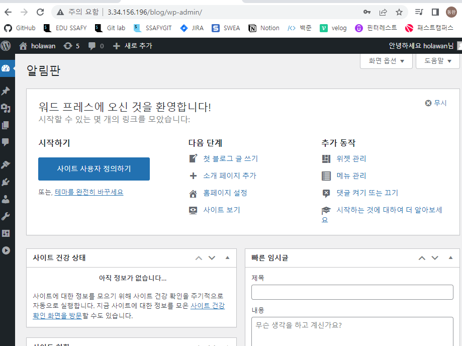

# 클론코딩 - 실제 서비스 구축

## 실제 바로 활용할 수 있는 사이트 작성해보기

- docker compose로 mysql + wordpress를 설치하고,
- nginx reverse proxy로 특정 경로로는 wordpress 서버 연결, 이외 경로는 별도 웹페이지를 구성할 수 있는 내부 nginx 서버로 이동 

#### Docker

- docker-compose.yml 파일 설정
    - nginx reverse proxy 서버를 만들고, nginx.conf 설정 파일로 proxy 설정
    - wordpress는 mysql이 필요하므로, 별도 mysql 서버를 도커로 구축
    - wordpress 도커 구축 

```yaml
version: "3"

services:
  #요청이 들어오면 적절한 위치로 forwading
  nginxproxy:
    depends_on:
      - nginx
      - db
      - wordpress
    image: nginx:latest
    ports:
      - "80:80"
    restart: always
    volumes:
      - "./nginx/nginx.conf:/etc/nginx/nginx.conf"

  nginx:
    image: nginx:latest
    restart: always

  db:
    image: mysql:5.7
    restart: always
    environment:
      MYSQL_ROOT_PASSWORD: somewordpress
      MYSQL_DATABASE: wordpress
      MYSQL_USER: wordpress
      MYSQL_PASSWORD: wordpress

  wordpress:
    depends_on:
      - db
    image: wordpress:5.7.0
    #테스트를 위한 8080 포트 오픈 
    ports:
      - "8080:80"
    restart: always
    environment:
      WORDPRESS_DB_HOST: db:3306
      WORDPRESS_DB_USER: wordpress
      WORDPRESS_DB_PASSWORD: wordpress
      WORDPRESS_DB_NAME: wordpress
```

### Nginx

- 현재 폴더에 하부 폴더로 nginx를 만들고, 해당 폴더에 nginx.conf 파일 작성 (즉, ./nginx/nginx.conf 파일 작성)

#### rewrite 옵션을 삭제한 이유 

- 접속 시 워드 프레스 이미지 자체적으로 여러 코드를 실행 시킬 수 있음 
    - 따라서, 자체적으로 여러 포트를 실행시키고, 다른 외부로 요청을 보낼 수 있는데 `/blog` url을 rewrite로 지워버리면 내부 서버에 요청을 보낼 수 있기 때문에, rewrite 금지  

- wordpres 서버 안에 있는 코드들이 기본적으로  `/usr/www/html`로 되어 있다면,앞의 blog가 붙지 않아서 잘못된 경로에서 파일을 찾을 수 있음. 따라서 wordpress 관련 폴더들은 모두 `usr/www/html/blog` 하위로 이동
- 따라서, 경로를 유지해서 호출하고, wordpress도 /blog/ 폴더에 설치

```nginx
user nginx;
worker_processes  auto;

error_log  /var/log/nginx/error.log warn;
pid        /var/run/nginx.pid;

events { 
    worker_connections 1024; 
}

http {
    include       /etc/nginx/mime.types;
    default_type  application/octet-stream;
    log_format  main  '$remote_addr - $remote_user [$time_local] "$request" '
                      '$status $body_bytes_sent "$http_referer" "$request_uri" "$uri"'
                      '"$http_user_agent" "$http_x_forwarded_for"';
    access_log  /var/log/nginx/access.log  main;    
    sendfile on;
    keepalive_timeout 65;

    upstream docker-wordpress {
        server wordpress:80;
    }

    upstream docker-web {
        server nginx:80;
    }

    server {
        location /blog/ {
            #rewrite ^/blog(.*)$ $1 break;
            #접속 시 자체적으로 여러 코드를 실행 시킴 
        	# 따라서, 여러 포트를 실행시키고, 다른 외부로 요청을 보낼 수 있는데 rewrite로 지워버리면 내부 서버에 요청을 보낼 수 있기 때문에, rewrite 금지  
            proxy_pass         http://docker-wordpress;
            proxy_redirect     off;
            proxy_set_header   Host $host;
            proxy_set_header   X-Real-IP $remote_addr;
            proxy_set_header   X-Forwarded-For $proxy_add_x_forwarded_for;
            proxy_set_header   X-Forwarded-Host $server_name;
        }
        
        location / {
            proxy_pass         http://docker-web;
            proxy_redirect     off;
            proxy_set_header   Host $host;
            proxy_set_header   X-Real-IP $remote_addr;
            proxy_set_header   X-Forwarded-For $proxy_add_x_forwarded_for;
            proxy_set_header   X-Forwarded-Host $server_name;
        }
    }
}

```

#### wordpress 설치 경로 변경

```
#wordpress 컨테이너 이름을 찾아서, 터미널로 접속
docker exec -it 06_wordpress_nginx_proxy_wordpress_1 /bin/bash

#내부는 WORKDIR이 /var/www/html이므로, 접속하면 바로 해당 폴더에 위치

cd ..			# /var/www 상위 폴더로 이동
mkdir blog		#/blog 폴더 생성
cd html/ 		#다시 /var/www/html 폴더로 이동
mv * ../blog/	#/var/www/html의 하위 폴더 포함 모든 파일을 blog 폴더로 이동
cd ..			#다시 /var/www 폴더로 이동
mv /blog /html 	# /var/www/blog 폴더의 모든 파일을 /var/www/html/blog 폴더로 이동

cd html/
ls
blog #다른 코드는 하나도 없어야함 
```

- 다음 폴더 접속
    - 워드프레스 설치 주소는 /wp-admin/install.php 이며, /blog/폴더에 넣었기 때문에, /blog/wp-admin/install.php가 됨 
        - nginx reverse roxy 서버에서 경로에 /blog 부분이 매칭되므로, 내부 wordpress 서버로 동일 주소로 요청하게 됨
    - http://localhost/blog/wp-admin/install.php

#### 서비스 접속해보기

`http://3.34.156.196/blog/wp-admin/`



### 나만의 사이트 + 워드프레스 도커 컴포즈 개선하기

- 볼륨을 많이 쓸 경우, 기존 볼륨이 유지됨에 따라, 컨테이너 수정 후, 재동작시 기존 볼륨 파일에 따라 다르게 동작할 수 있으므로, 필요시 다음 명령으로 깔끔하게 도커 이미지, 컨테이너, 볼륨을 삭제한 후, 작업하는 것이 좋음

```
#모든 컨테이너 삭제
docker stop $(docker ps -a -q)
docker rm $(docker ps -a -q)
<<<<<<< HEAD
docker rmi -f $(docker images -q)
=======
docker rmi -f $(docker images)
>>>>>>> b70f22987d20348f5697cb979cf7bc748bf2402c

#쓰지 않는 볼륨 삭제
docker volume prune

#쓰지 않는 이미지, 볼륨, 네트워크 삭제
docker system prune -a --volumes 
```


#### docker-compose.yml 개선하기 

- 공식 이미지를 사용하면, 내부 조작에 한계가 있을 수는 있으며, 필요시 직접 Ubuntu에 wordpress 소스 파일을 직접 설치하고, 조작하여 이미지를 생성할 수도 있음

- 볼륨을 사용해서, 보존하거나, 별도로 유지보수해야할 폴더 설정 

```yaml
version: "3"

services:
  nginxproxy:
    depends_on:
      - nginx
      - db
      - wordpress
    image: nginx:latest
    container_name: proxy 
    ports:
      - "80:80"
    restart: always
    volumes:
      - "./nginx/nginx.conf:/etc/nginx/nginx.conf"

  nginx:
    image: nginx:latest
    container_name: myweb 
    restart: always
    volumes:
      - "./myweb:/usr/share/nginx/html"

  db:
    image: mysql:5.7
    container_name: mysqldb 
    volumes:
      - "mydb:/var/lib/mysql"
    restart: always
    environment:
      MYSQL_ROOT_PASSWORD: somewordpress
      MYSQL_DATABASE: wordpress
      MYSQL_USER: wordpress
      MYSQL_PASSWORD: wordpress

  wordpress:
    depends_on:
      - db
    build:
      context: ./wp
      dockerfile: Dockerfile
    container_name: wp 
    restart: always
    volumes:
      - "./html:/var/www/html"
    environment:
      WORDPRESS_DB_HOST: db:3306
      WORDPRESS_DB_USER: wordpress
      WORDPRESS_DB_PASSWORD: wordpress
      WORDPRESS_DB_NAME: wordpress

volumes:
  mydb:
```

### Wordpresss Dockerfile 작성하기

- 하위 폴더로 wp 폴더 생성 후, 내부에 Dockerfile 생성
- 워드프레스 공식 이미지는 최종적으로 /usr/src/wordpress 폴더를 /var/www/html 폴더에 덮어씌움

```
FROM wordpress:5.7.0

RUN mkdir -p /usr/src/blog
RUN mkdir -p /usr/src/blog/wp-content/plugins
RUN mkdir -p /usr/src/blog/wp-content/uploads
RUN cp -rf /usr/src/wordpress/* /usr/src/blog
RUN mv /usr/src/blog /usr/src/wordpress/
RUN chown -R www-data:www-data /usr/src/wordpress
RUN find /usr/src/wordpress/blog/ -type d -exec chmod 0775 {} \;
RUN find /usr/src/wordpress/blog/ -type f -exec chmod 0775 {} \;
```

- blog 폴더에 해당 파일을 이동시키기 위한 RUN 명령어와, 워드프레스 플러그인/테마 관련 폴더 생성을 위한 폴더 생성/권한 설정
    - find의 -type d는 폴더를 의미, -type -f는 파일을 의미 (폴더는 실행이 가능한 폴더로, 파일은 소유자는 읽고/쓰기, 그 외에는 읽기 권한만 제공)
<<<<<<< HEAD
=======

#### docker compose 실행

- 하위 폴더 중 html 폴더는 다음 명령으로 완전히 
>>>>>>> b70f22987d20348f5697cb979cf7bc748bf2402c
